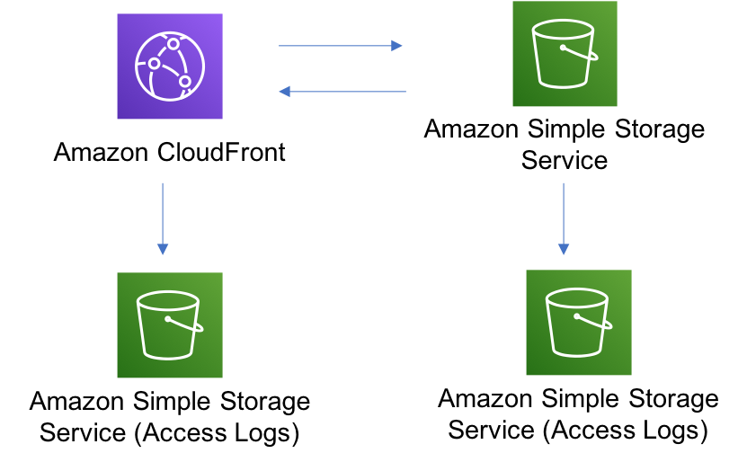
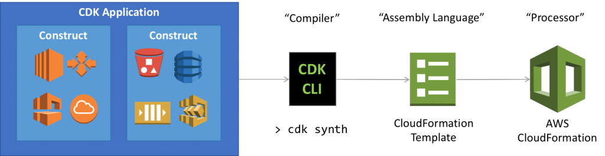
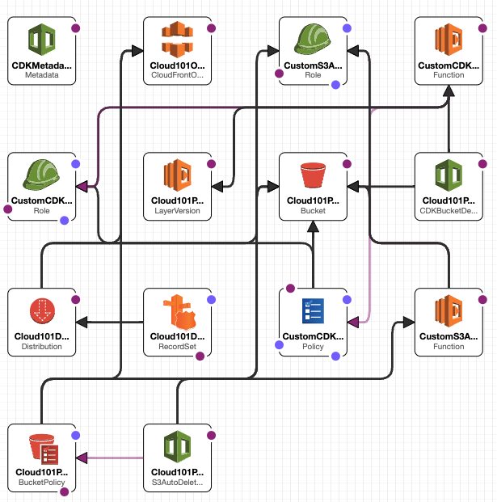
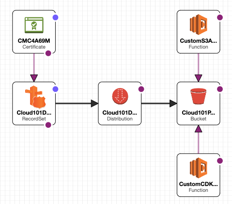

# CDK

Infrastructure as code


Randy Vroegop

---

# CDK 101

The plan:


---

# Install AWS CLI & CDK

[🌍 AWS CLI](https://docs.aws.amazon.com/cli/latest/userguide/getting-started-install.html)
[🌍 NODE.JS](https://nodejs.org/en/download)

<console>$ npm install --global aws-cdk</console>

--

# Login

<console>$ aws configure sso</console>

```console
SSO session name (Recommended): Luminis
SSO start URL [None]: https://luminis.awsapps.com/start/
SSO region [None]: eu-west-1
SSO registration scopes [sso:account:access]:
CLI default client Region [None]: eu-west-3
CLI default output format [None]: table
```

<p title file>~/.aws/config</p>

```config
[default]
sso_session = Luminis
sso_account_id = 531843824238
sso_role_name = AWSAdministratorAccess
region = eu-west-3
output = table
  
[sso-session Luminis]
sso_start_url = https://luminis.awsapps.com/start/
sso_region = eu-west-1
sso_registration_scopes = sso:account:access

```

---

# IAC Structure


--

# Infrastructure

## *CI/CD*

* Repository
* Pipelines
* Build stages

--

# Infrastructure

## *Serverless*

* API Gateway
* Cognito
* Lambda
* DynamoDB

---

<p title construct>Construct</p>

```ts
new Bucket(this, id, props);
```

--

<p title stack>Stack</p>

```ts
export class BucketStack extends Stack {
  constructor(scope: Construct, id: string, props?: StackProps) {
    super(scope, id, props);

    new Bucket(this, id, props);
  }
}
```

--

<p title test>StackTest</p>

```ts
test('Test if bucket is created', () => {
  const app = new cdk.App();

  const stack = new BucketStack(app, 'MyBucketStack');
  const template = Template.fromStack(stack);

  expect(template.resources).toHaveProperty('AWS::S3::Bucket');
});
```

---

## ⚖️ Full control and regulation

## 🔧 Quick results and control

## ⚡️ Proof of Concept

--

<p title construct>Level 1 </p>

```ts
// Create S3 bucket
const bucket = new CfnBucket(this, 'MyBucket', {
  bucketName: 'my-bucket',
  accessControl: 'Private'
});

// Create CloudFront distribution
const distribution = new CfnDistribution(this, 'MyDistribution', {
  distributionConfig: {
    origins: [
      {
        domainName: bucket.attrDomainName,
        id: 'S3Origin',
        s3OriginConfig: {
          originAccessIdentity: ''
        }
      }
    ],
    defaultCacheBehavior: {
      targetOriginId: 'S3Origin',
      forwardedValues: {
        queryString: false,
        cookies: { forward: 'none' },
        headers: ['Origin']
      },
      viewerProtocolPolicy: 'redirect-to-https'
    },
    enabled: true
  }
});

// Grant CloudFront access to the S3 bucket
const bucketPolicy = new CfnResource(this, 'BucketPolicy', {
  type: 'AWS::S3::BucketPolicy',
  properties: {
    bucket: bucket.ref,
    policyDocument: {
      Version: '2012-10-17',
      Statement: [
        {
          Sid: 'AllowCloudFrontAccess',
          Effect: 'Allow',
          Principal: '*',
          Action: 's3:GetObject',
          Resource: `arn:${this.partition}:s3:::${bucket.ref}/*`,
          Condition: {
            StringLike: {
              'aws:Referer': `https://${distribution.attrDomainName}`
            }
          }
        }
      ]
    }
  }
});
```

--

<p title construct>Level 2</p>

```ts
const bucket = new Bucket(this, 'MyBucket', {
  bucketName: 'my-bucket'
});
bucket.grantRead(distribution);
```

--

<p title construct>Level 3</p>

```ts
new CloudFrontToS3(this, 'cloudfront-s3', {});
```



---

# Live Demo

--

<console>$ cdk init --language typescript</console>
<console>$ npm test</console>
<console>$ npm run build</console>
<console>$ cdk synth</console>
<console>$ cdk deploy</console>

--



--



--


